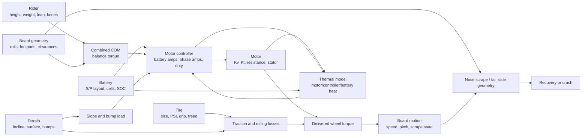

# Realism Systems Index

## Doc Header

### Doc History

2. 2026-05-26 07:10:17: Marked `Realism-Systems-1` accepted after the first runtime architecture pass landed structured model ownership, first controller/battery controls, COM display, tire/surface modeling, thermal rollback signals, and validation placeholders.
1. 2026-05-26 06:54:44: Created the realism systems family index from the original `docs/realism-systems-plan.md` phase ladder.

### Purpose

This index routes the realism systems vision into implementation-sized family phases.

## Doc Body

The realism systems family owns the simulation model behind the side-scroller: physical specs, electrical limits, rider/body behavior, terrain/grip, scrape recovery, and validation.

Use this index to decide which future plan owns a realism change before editing `/app`.

## Vision

The first generation of realism work should create a better simulation architecture without breaking the playable prototype. It should make current formulas easier to replace, add clear ownership boundaries, and prepare the model for battery/controller, COM, tire, thermal, and validation upgrades.

## Wishlist Organization

### High Level Goals

- [ ] `RSG1-HLG-1. Model tire size, grip, PSI, compound, tread, and terrain interaction.`
- [ ] `RSG1-HLG-2. Model motor Kv, Kt, resistance, stator size, torque production, and heat.`
- [ ] `RSG1-HLG-3. Model battery S/P layout, cell behavior, voltage sag, max current, and state of charge.`
- [ ] `RSG1-HLG-4. Model controller battery amps, phase amps, duty, voltage limits, field weakening, and cutoff behavior.`
- [ ] `RSG1-HLG-5. Model board rails, footpads, axle location, scrape geometry, and nose/tail contact.`
- [ ] `RSG1-HLG-6. Model rider height, weight, lean, knee bend, jump/crouch, and recovery input.`
- [ ] `RSG1-HLG-7. Model board COM, rider COM, and combined COM as a visible balance driver.`
- [ ] `RSG1-HLG-8. Explain failures through phase-current saturation, battery limit, duty limit, voltage sag, thermal rollback, traction loss, or geometry scrape.`
- [ ] `RSG1-HLG-9. Validate model behavior against real ride logs and reference scenarios over time.`

### Codex Level Goals

- [ ] CLG 1. Split the simulation into named subsystem ownership boundaries.
- [ ] CLG 2. Replace ambiguous electrical labels with battery current, phase current, watts, duty, voltage sag, and thermal headroom.
- [ ] CLG 3. Move formulas toward structured specs and unit conversion helpers.
- [ ] CLG 4. Add visible COM and geometry-driven scrape/fall behavior.
- [ ] CLG 5. Add validation hooks for reference runs and future ride-log comparison.

## Family Phase Ladder

- [x] `Realism-Systems-1` - Model Architecture Foundation: create subsystem ownership, data-model cleanup, battery/controller separation, COM direction, tire/terrain direction, thermal rollback direction, and validation path.
- [ ] `Realism-Systems-2` - Electrical And Controller Model: implement cell layout, sag, controller limits, requested/delivered current, and duty behavior.
- [ ] `Realism-Systems-3` - COM And Rider Dynamics: implement rider COM, board COM, combined COM, knee bend, stance, lean rate, and scrape recovery input.
- [ ] `Realism-Systems-4` - Tire Terrain And Traction: implement PSI, compound, tread, surface presets, rolling resistance, grip margin, slip, and bump impulses.
- [ ] `Realism-Systems-5` - Thermal Rollback And Validation: implement motor/controller/battery temperature, rollback, reference scenarios, and future log comparison.

## Future Plans

- `Future/Realism-Systems-1 - Model Architecture Foundation.md`

## System Dependency Graph

